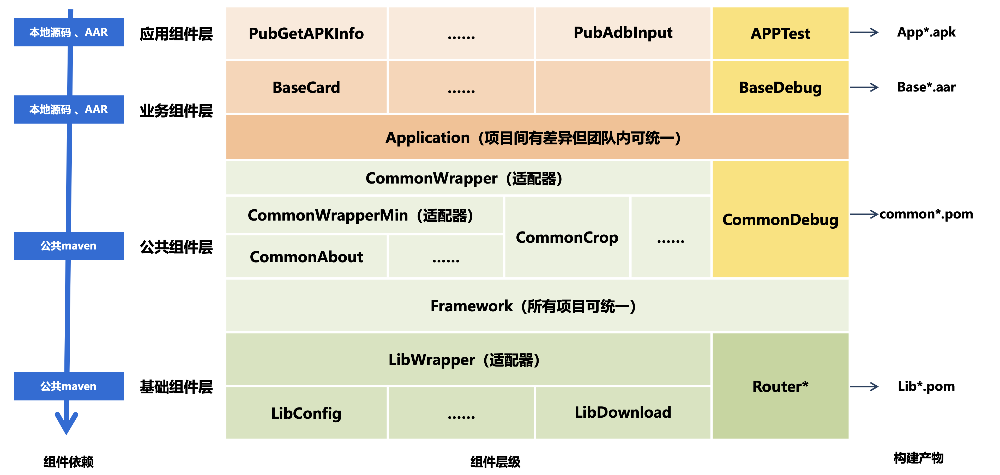

# 写在前面

做酱油的时候发现做开发那么久竟然没有一整套顺手的开发方案，要从头开始一个一个搭建（相当于之前做的就没什么沉淀），因此开始逐渐整理一整套相对全面并且顺手的开发方案。随着这几年逐渐完善，现在基本上具备雏形了，因此逐渐总结一下。

AAF 是基于组件化方案，逐渐积累整理的一套完整的**组件化开发，多维度复用**的 Android 终端开发方案。

在新方案的设计和优化过程中，我们的最终目标是**方案使用一套代码支持所有项目并对开发友好**。具体表现为：**统一技术栈**，**相同问题**彻底研究一次，然后提供**统一解决方案**，后续可以直接放心使用。最终做到一个项目的技术方案可以**高效便捷复用**到另一个项目，或者可以快速在框架基础上开发出一个独立全新的应用，开发过程中基本聚焦在新业务的逻辑，而不是基础功能。

# 框架介绍

这是AAF的一个总体架构：

整个AAF框架共有四层：

- **基础组件**：基础组件 `Router*` 是路由相关的基础组件，`Lib*` 是自己沉淀或者统一对比以后选择的第三方技术栈，**与业务无关，可通用**。

- **公共组件**：基础框架 `Framework` 负责通用资源、公共声明、页面路由以及对于底层第三方库的二次封装，所有业务通用的基础通用功能。`Common*` 则是聚焦一个具体的业务无关的功能，例如反馈、内置浏览器等，这部分功能**也与业务无关，可通用**。

- **业务组件**：基础框架 `Application` 包含与业务相关的一些公共资源定义，基础功能封装等。`Base*` 则是聚焦一个具体的业务功能，例如页面卡片、广告等。

- **应用组件**：应用组件是可以独立运行的最小单元，而且他们基本只是一个Android Application 的空壳加一些配置文件，所有的业务逻辑都在业务组件层实现。其中里面比较特别的是APPTest，他既是底层业务组件开发中的临时入口，同时也是一些基础功能 和 所有 Pub的测试入口。

对于整个框架的更多内容，可以参考 [AAF相关文档](./summary/links.md) 里面列出来的文章。

对于基于框架开发的应用，可以参考 [应用事例](./summary/samples.md) 里面列举的具体应用案例。

# 框架使用

这个系列的文档重点介绍 AAF 框架的使用，包括：

- 组件使用：如何在自己开发的项目中直接使用 AAF 提供的基础库

- 框架使用：如何直接基于 AAF 开发新的应用

对于「组件使用」没有门槛，就是常见的 maven 第三方库，可以直接引入并使用，文档中这部分内容主要介绍了当前包含的基础组件及其对应的功能。

**对于「框架使用」和「框架开发」，熟悉、理解和使用有一定门槛，建议先仔细阅读 [安卓开发那些事总纲](https://blog.bihe0832.com/android-dev-summary.html) 里面关于「组件化框架介绍」的内容。**

