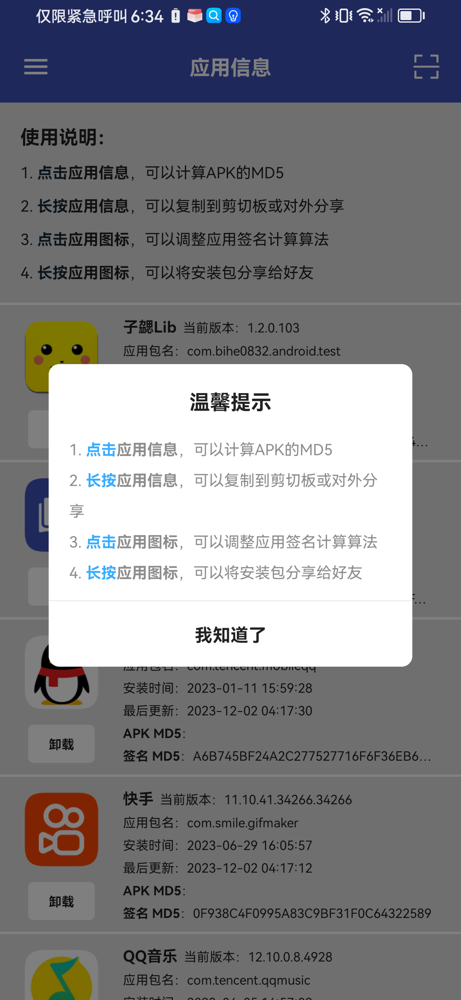
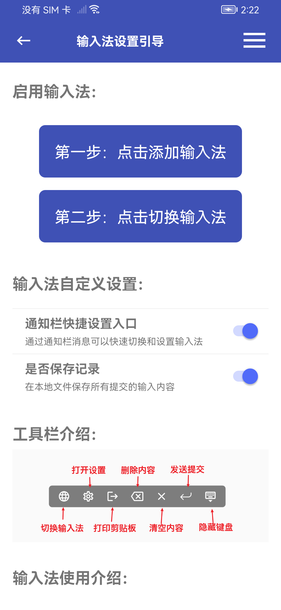
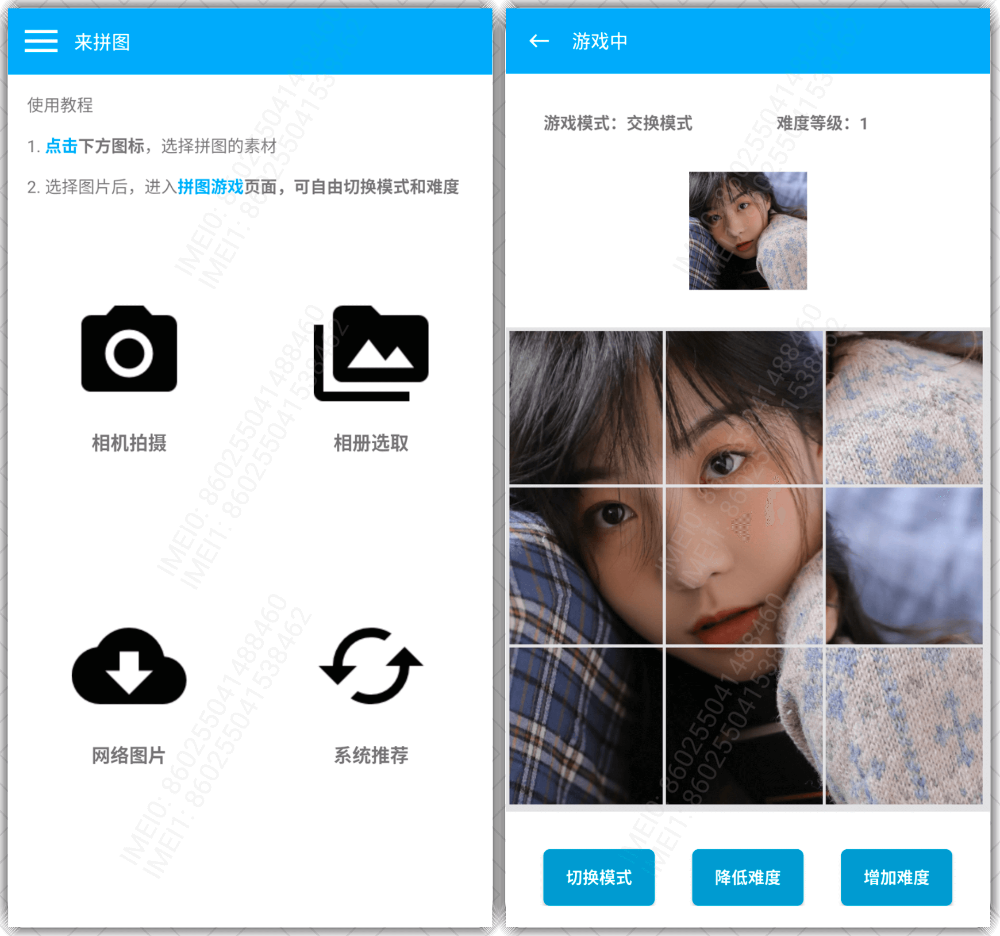
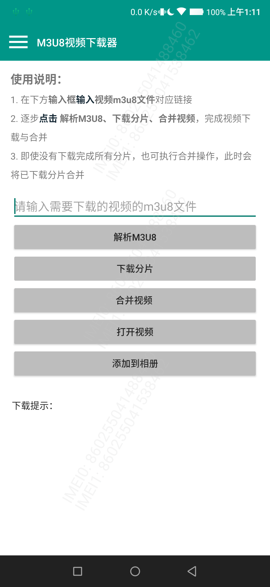
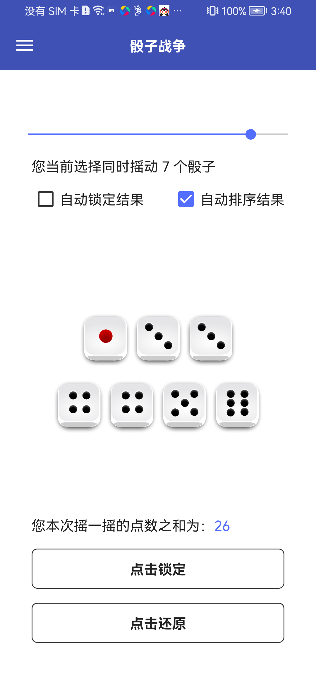

## 应用信息获取

### 应用简介
    
一款可以获取设备应用包名、签名、版本、安装时间、MD5等基础信息的调试工具。

渠道SDK开发者、SDK联调同学、应用开发者的福音

### 应用截图



### 应用下载

[点击下载到本地](https://android.bihe0832.com/app/release/ZAPK_official.apk)


 
## ADB 快捷输入

### 应用简介
    
一款基于ADB的，可以通过电脑快速输入中文等信息的快捷输入法，主要解决ADB命令无法输入中文的问题

### 应用截图



### 应用下载

[点击下载到本地](https://android.bihe0832.com/app/release/ZINPUT_official.apk)


### 输入命令

详细快捷输入命令事例可以参考：[https://github.com/bihe0832/Settings-Tools/blob/master/config/mac/.zshrc](https://github.com/bihe0832/Settings-Tools/blob/master/config/mac/.zshrc)

- 简单文本输入：主要用于简单的中文输入，一次即可完成输入

    `adb shell am broadcast -a ZIXIE_ADB_INPUT_TEXT --es msg DATA`

    其中DATA就是你要输入的内容

- 复杂文本输入：主要对于有特殊符号等的文本输入，要先输入命令，再输入内容

    `echo "请输入你要通过 ADB 输入内容的原文" && read input && content=$( base64 <<< $input ) && adb shell am broadcast -a ZIXIE_ADB_INPUT_BASE64 --es msg $content`

    命令结束后输入原文，自动完成转码和输入

- 自动发送：

	`adb shell input keyevent 66`
    
- shell 切换到当前输入法

    ```
    fun zixieadbinputchangetozixieinput(){
		# 获取当前输入法包名
		current_ime=$(adb shell settings get secure default_input_method | tr -d '\r')
		echo "$current_ime"
	
		# 判断输入法是否为指定的包名
		if [[ "$current_ime" != "com.bihe0832.adb.input/com.bihe0832.android.base.adb.input.ZixieIME" ]]; then
			echo "$current_ime"
			adb shell ime set com.bihe0832.adb.input/com.bihe0832.android.base.adb.input.ZixieIME && sleep 2
		fi
	}
    ```
## 拼图游戏

### 应用简介
    
一款可以自定义难度、自选照片、自选模式的拼图游戏工具。

打发时间的利器，制造惊喜的魔术，锻炼脑力的工具。

### 应用截图



### 应用下载

[点击下载到本地](https://android.bihe0832.com/app/release/ZPUZZLE_official.apk)


## M3U8视频下载器

### 应用简介
    
一款可以通过视频的M3U8文件，下载并解密合成完整视频的工具。

看片神器，再也不用担心关键时刻没信号了。

### 应用截图



### 应用下载

[点击下载到本地](https://android.bihe0832.com/app/release/ZM3U8_official.apk)


## 摇吧

### 应用简介
    
一款基于摇一摇的小游戏应用。

### 应用截图



### 应用下载

[点击下载到本地](https://android.bihe0832.com/app/release/ZSHAKE_official.apk)


       
            