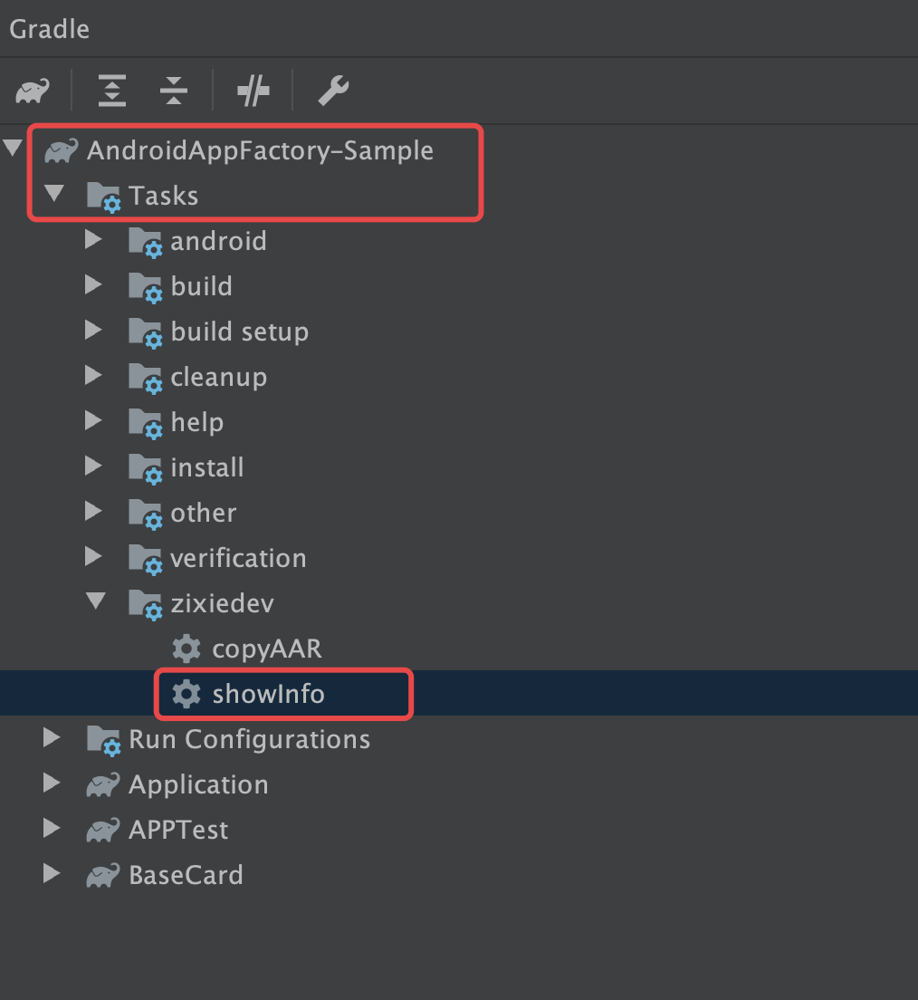

**AAF 对于Android的构建方式做了一定范围的重构与定制。**为了更贴近实际开发的场景，Demo 选择使用 [AndroidAppFactory-Sample](https://github.com/bihe0832/AndroidAppFactory-Sample) 来介绍。目前开发中可以根据开发内容按组件最小依赖进行开发，因此Demo演示也采用最小依赖的方式开发。

## 与标准 Android 项目开发的区别

### 组件依赖

所有 `api` 或者 `implementation` 类型的依赖，不再分散在模块的`build.gradle`，统一迁移到 `dependencies.gradle`

### 构建配置

当前集成的模块，不再通过`settings.gradle`配置，通过修改 `dependencies.gradle` 中的 `ext.mainProject`、`ext.developModule`、`ext.includeALLDependOnDevelopModule`、`ext.pubModuleIsApplication`来控制，对于四个字段的具体含义，参考代码。

## 运行Demo

### 开发并运行APPTest

- 修改项目配置

    ```Java
    ext.mainProject = "APPTest"
    ext.developModule = "Application"
    ext.includeALLDependOnDevelopModule = false
    ext.pubModuleIsApplication = true
    ```

- 查看项目导入信息

    导入以后，点击右侧 Gradle 工具栏，运行`:showInfo`，如下图：

    

    然后在控制台可以看到下面的信息

    ```Java
    ========================================

    当前工程导入组件如下：

        [APPTest, Application, BaseCard]

    ========================================
    ```

- 运行项目

    此时直接运行项目，就可以运行 APPTest

### 开发并运行PubGetAPKInfo

- 修改项目配置

    ```Java
    ext.mainProject = "PubGetAPKInfo"
    ext.developModule = "Application"
    ext.includeALLDependOnDevelopModule = false
    ext.pubModuleIsApplication = true
    ```

    此时项目导入的项目为：[PubGetAPKInfo, Application, BaseCard]

- 运行项目

    此时直接运行项目，就可以运行 PubGetAPKInfo


### 将PubGetAPKInfo作为APPTest的模块开发并运行

- 修改项目配置

    ```Java
    ext.mainProject = "APPTest"
    ext.developModule = "Application"
    ext.includeALLDependOnDevelopModule = false
    ext.pubModuleIsApplication = false
    ```

- 修改 APPTest 的依赖

    修改 `dependencies.gradle` 中关于 APPTest的依赖的内容，修改为：

    ```Java
     "APPTest"       : [
                "apidependenciesList": ["PubGetAPKInfo",
                                        "com.bihe0832.android:common-test:${project.aaf_version}",
                                        "Application", "BaseCard"
                ]
        ],
    ```

    此时项目导入的项目为：[APPTest, Application, PubGetAPKInfo, BaseCard]

- 运行项目

    此时直接运行项目，就可以运行 APPTest，而且运行后的安装包，包含 PubGetAPKInfo 的完整内容

## 常见错误

### AndroidX 没开启

- 错误描述：

        Caused by: com.android.builder.errors.EvalIssueException: Configuration debugRuntimeClasspath contains AndroidX dependencies, but the android.useAndroidX property is not enabled, which may cause runtime issues.

- 错误原因：

    出现此错误时，需要在 `gradle.properties` 文件增加配置 `android.useAndroidX=true`。
    
- 解决方案：

    由于 `gradle.properties` 文件会包含 一些编译环境（例如 Java Home 等环境变量等）、自定义数据（签名信息等敏感数据）等，所以开发中一般都是使用本地的全局配置，而不放在项目代码中。因此在项目中找不到 `gradle.properties` 文件。你可以在项目新增 `gradle.properties` 文件 并添加配置，具体事例可以参考：https://github.com/bihe0832/Settings-Tools/blob/master/as/gradle.properties
    
    或者在 Android Studio 的 Settings 里面的 Gradle 配置设置你自定义的全局配置的地址。

