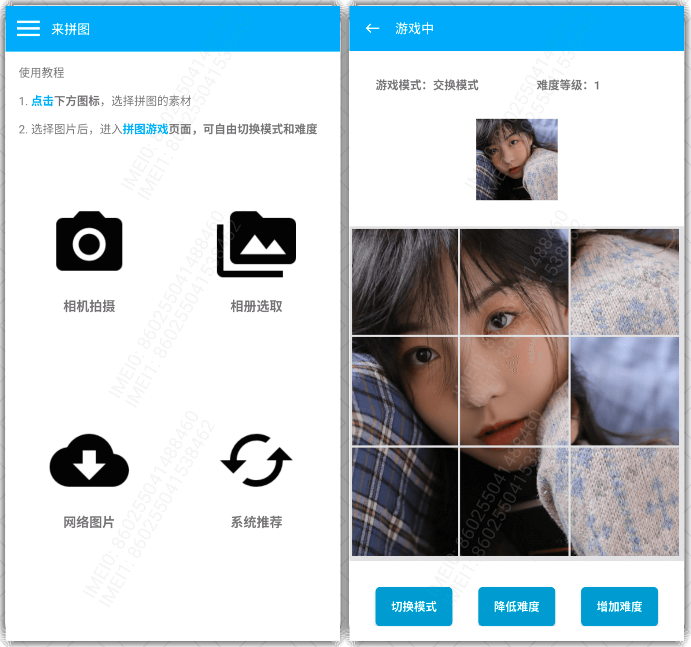

## 应用信息获取

### 应用简介
    
一款可以获取设备应用包名、签名、版本、安装时间、MD5等基础信息的调试工具。

渠道SDK开发者、SDK联调同学、应用开发者的福音

### 应用截图

### 应用下载

[点击下载到本地](https://android.bihe0832.com/app/release/ZAPK_official.apk)

 
## 拼图游戏

### 应用简介
    
一款可以自定义难度、自选照片、自选模式的拼图游戏工具。

打发时间的利器，制造惊喜的魔术，锻炼脑力的工具。

### 应用截图

### 应用下载

[点击下载到本地](https://android.bihe0832.com/app/release/ZPUZZLE_official.apk)

## M3U8视频下载器

### 应用简介
    
一款可以通过视频的M3U8文件，下载并解密合成完整视频的工具。

看片神器，再也不用担心关键时刻没信号了。

### 应用截图

### 应用下载

[点击下载到本地](https://android.bihe0832.com/app/release/ZM3U8_official.apk)

    
            