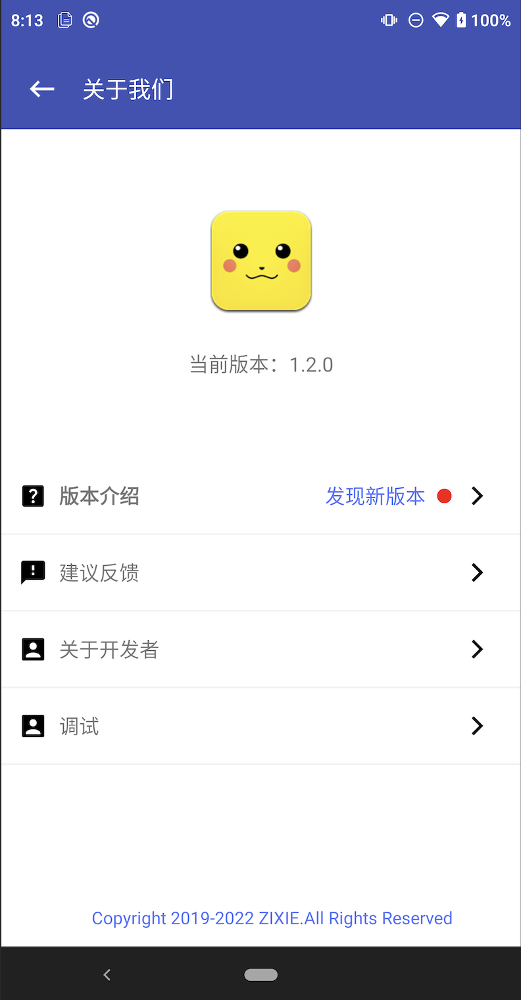

# CommonAbout


[  ](https://github.com/bihe0832/AndroidAppFactory/tree/master/CommonAbout)
[  ](https://search.maven.org/artifact/com.bihe0832.android/common-about)

## 功能简介

基于公共框架的通用关于页面

## 组件信息

#### 引用仓库

引用仓库可以参考 [组件使用](./../start.md) 中添加依赖的部分

#### 组件使用

```groovy
implementation 'com.bihe0832.android:common-about:+'
```

## 组件功能

### AboutActivity

整合了图标、版本、更多信息的关于页面（支持唤起调试信息）



### AboutFragment

通用的关于页面的更多信息