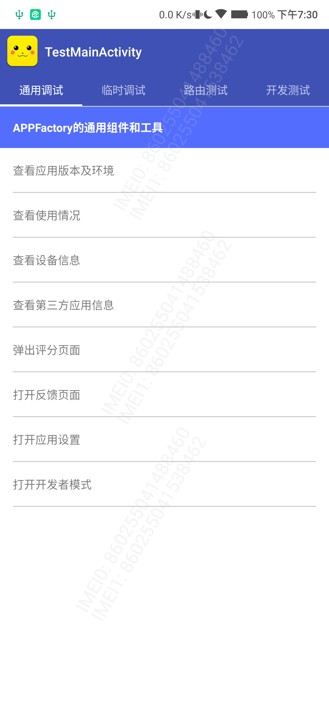
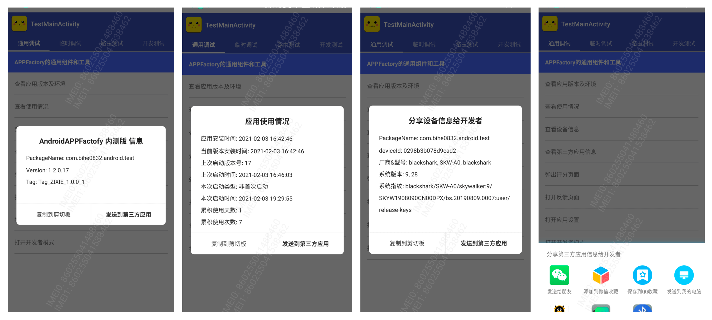

# CommonDebug


[  ](https://github.com/bihe0832/AndroidAppFactory/tree/master/CommonDebug)
[  ](https://search.maven.org/artifact/com.bihe0832.android/common-debug)


## 功能简介

基于公共框架的通用内部测试组件，提供通用的调试主界面，列表页面，列表样式，通用的调试方法

## 组件信息

#### 引用仓库

引用仓库可以参考 [组件使用](./../start.md) 中添加依赖的部分

#### 组件使用

```groovy
implementation 'com.bihe0832.android:common-debug:+'
```

## 组件功能

### DebugMainFragment

提供一个支持多TAB切换的Fragment，例如：



### DebugMainActivity

提供一个空白的，通过类名就能加载Fragment的空白调试 Activity

### BaseDebugActivity & BaseDebugFragment & BaseDebugListActivity & BaseDebugListFragment

基础的测试列表页，同时提供打开网页、弹出输入框、跳转Activity、基于 [LibDebug](./../libs/noui/lib-debug.md) 的调试信息文本分享等基础功能

### DebugDebugCommonFragment & DebugEnvFragment

基于 BaseDebugListFragment 的 AAF 通用调试方法，包括查看应用版本及环境、使用情况，查看设备信息，单选切换，第三方应用信息获取，以及一些快速跳转的功能入口



### DebugRouterFragment

基于 BaseDebugListFragment 的 AAF 路由测试验证入口

### DebugLogActivity

基于AceEditor提供了简单的日志查看工具
