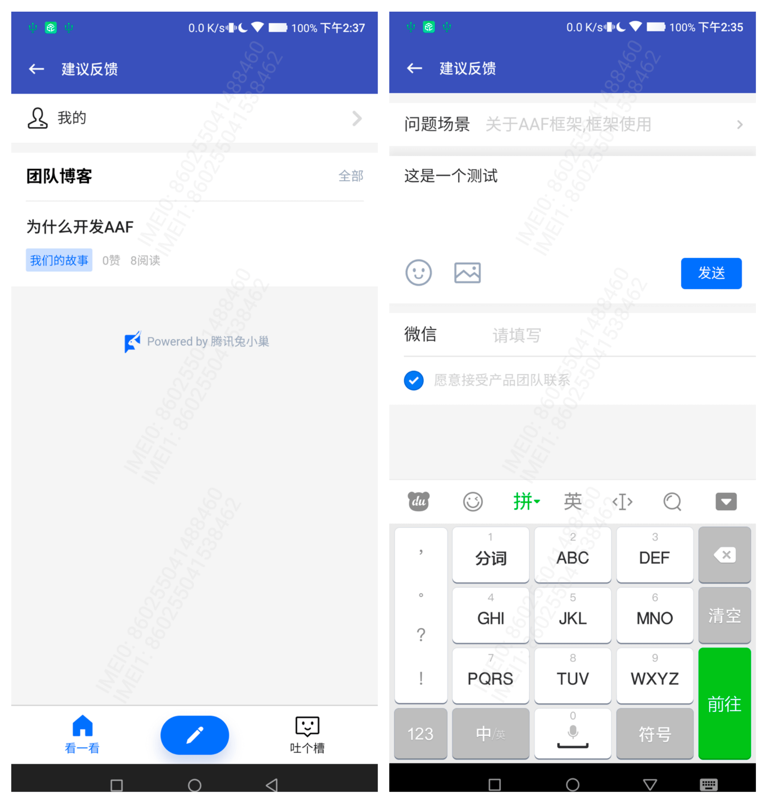
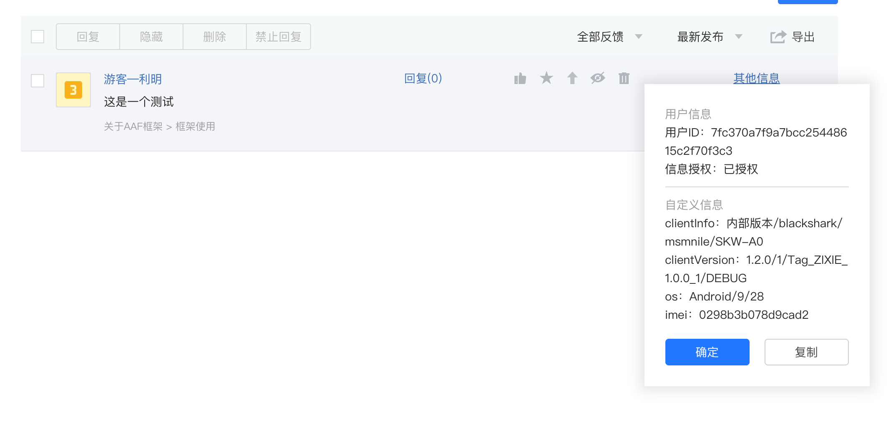

# CommonTBSFeedback


[  ](https://github.com/bihe0832/AndroidAppFactory/tree/master/CommonTBSFeedback)
[  ](https://search.maven.org/artifact/com.bihe0832.android/common-feedback-tbs)

## 功能简介

基于公共框架，结合腾讯吐槽添加的用户反馈组件，底层使用X5内核的Webview

## 组件使用

#### 引用仓库

引用仓库可以参考 [组件使用](./../start.md) 中添加依赖的部分

#### 组件使用

```groovy
implementation 'com.bihe0832.android:common-feedback-tbs:+'
```

## 组件功能

基于 [腾讯吐槽](https://support.qq.com/products/290858) 通过网页打开的用户反馈模块。会自动收集基础信息。

用户界面：



反馈提交以后管理端界面：



