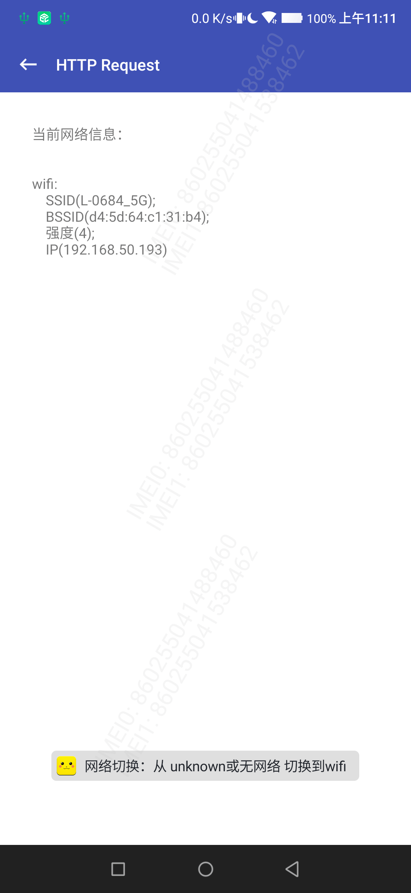

# CommonNetwork


[  ](https://github.com/bihe0832/AndroidAppFactory/tree/master/CommonNetwork)
[  ](https://bintray.com/bihe0832/android/common-network/_latestVersion)

## 功能简介

基于公共框架，进一步封装的网络状态监听组件

## 组件信息

#### 引用仓库

引用仓库可以参考 [组件使用](./../start.md) 中添加依赖的部分

#### 组件使用

```groovy
implementation 'com.bihe0832.android:common-network:+'
```

## 组件功能

### NetworkChangeManager(需要初始化)

- 提供了网络切变的回调，回调切变前后的网络变化，可以配合 DeviceInfoManager 获取更多信息，例如下图是一个测试场景的效果：

    

上面效果的代码可以参考：[https://github.com/bihe0832/AndroidAppFactory/tree/master/BaseTest/src/main/java/com/bihe0832/android/base/test/network/TestNetworkActivity.kt](https://github.com/bihe0832/AndroidAppFactory/tree/master/BaseTest/src/main/java/com/bihe0832/android/base/test/network/TestNetworkActivity.kt)

