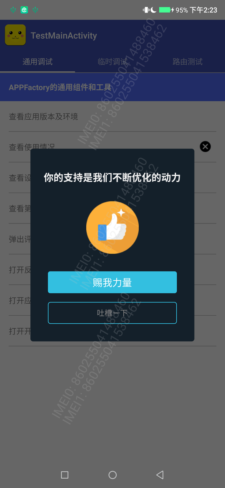

# CommonPraise


[  ](https://github.com/bihe0832/AndroidAppFactory/tree/master/CommonPraise)
[  ](https://bintray.com/bihe0832/android/common-praise/_latestVersion)

## 功能简介

基于公共框架的用户求好评组件

## 组件信息

#### 引用仓库

引用仓库可以参考 [组件使用](./../start.md) 中添加依赖的部分

#### 组件使用

```groovy
implementation 'com.bihe0832.android:common-praise:+'
```

## 组件功能

### 使用效果



- 通用的用户求好评组件

- 可以引导前往应用商店（根据机型判断）

- 可以引导前往吐槽页面

### 使用方式

```kotlin
UserPraiseManager.showUserPraiseDialog(activity!!, RouterAction.getFinalURL(MODULE_NAME_FEEDBACK))
```