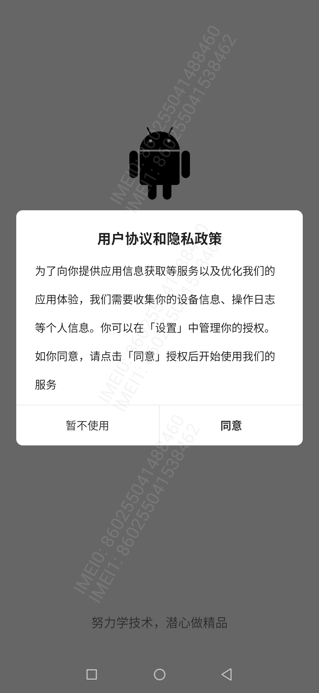

# CommonSplash


[  ](https://github.com/bihe0832/AndroidAppFactory/tree/master/CommonSplash)
[  ](https://bintray.com/bihe0832/android/common-splash/_latestVersion)

## 功能简介

基于公共框架，进一步封装的闪屏、用户隐私与协议

## 组件信息

#### 引用仓库

引用仓库可以参考 [组件使用](./../start.md) 中添加依赖的部分

#### 组件使用

```groovy
implementation 'com.bihe0832.android:common-splash:+'
```

## 组件功能

### AgreementPrivacy

- 基于 [TextFactoryUtils](./../libs/noui/lib-text.md#textfactoryutils) 将文字转换为带跳转链接文字，生成隐私相关的跳转链接

- 展示首次启动时的用户隐私协议弹框



### SplashActivity

- 简单的闪屏UI，支持Icon，APPName 和 Slogan，判断用户安装情况弹出隐私框


