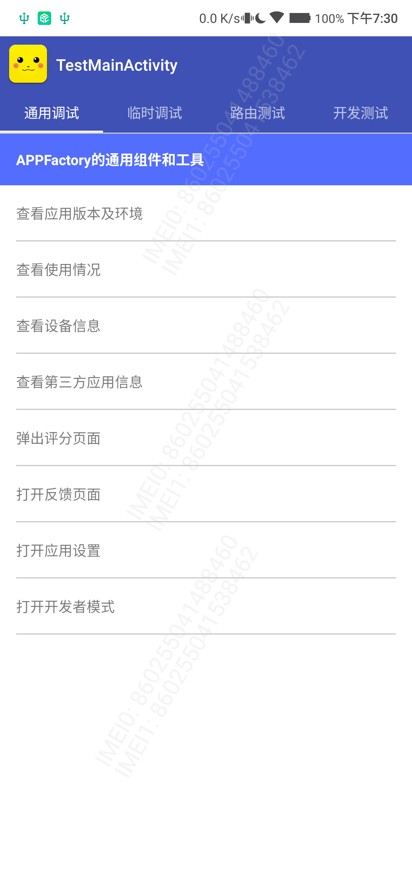
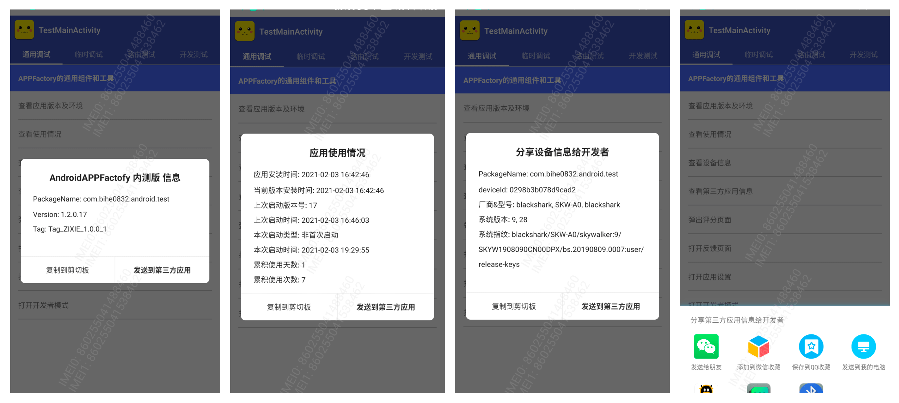

# CommonTest


[  ](https://github.com/bihe0832/AndroidAppFactory/tree/master/CommonTest)
[  ](https://bintray.com/bihe0832/android/common-test/_latestVersion)

## 功能简介

基于公共框架的通用内部测试组件，提供通用的调试主界面，列表页面，列表样式，通用的调试方法

## 组件信息

#### 引用仓库

引用仓库可以参考 [组件使用](./../start.md) 中添加依赖的部分

#### 组件使用

```groovy
implementation 'com.bihe0832.android:common-test:+'
```

## 组件功能

### TestMainFragment

提供一个支持多TAB切换的Fragment，例如：



### BaseTestActivity & BaseTestFragment

基础的测试列表页，同时提供打开网页、弹出输入框、跳转Activity、基于 [LibDebug](./../libs/noui/lib-debug.md) 的调试信息文本分享等基础功能

### TestDebugCommonFragment

基于 BaseTestFragment 的 AAF 通用调试方法，包括查看应用版本及环境、使用情况，查看设备信息，第三方应用信息，以及一些快速跳转的功能入口

