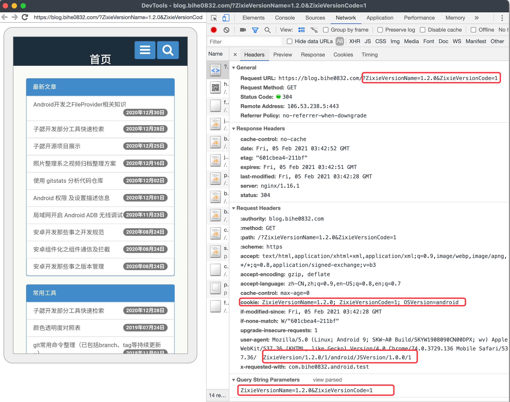
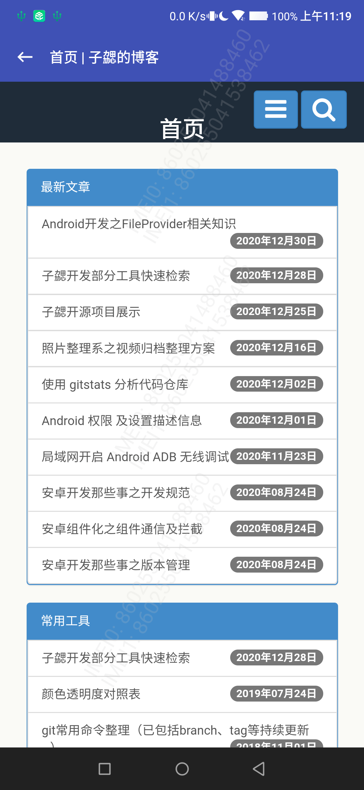

# CommonWebview


[  ](https://github.com/bihe0832/AndroidAppFactory/tree/master/CommonWebview)
[  ](https://search.maven.org/artifact/com.bihe0832.android/common-webview)

## 功能简介

基于公共框架，进一步封装的通用webview，对于通用Webview 相关的内容，可以查看 [LibWebview](./../libs/ui/lib-webview.md)

## 组件信息

#### 引用仓库

引用仓库可以参考 [组件使用](./../start.md) 中添加依赖的部分

#### 组件使用

```groovy
implementation 'com.bihe0832.android:common-webview:+'
```

## 组件功能

### BaseWebviewFragment

- 封装好的通用的 [Webview](./../libs/ui/lib-webview.md) 的Fragment，支持：

    下拉刷新，请求追加业务参数，错误页面及错误重试，非 Http 协议使用 Intent 唤起，获取网页标题

- 支持Jsbridge，使用方式可以参考 [JSBridge](./../../tools/android_jsbridge.md)

### CommonWebviewFragment

- 对于 BaseWebviewFragment 的 进一步封装，打开时会自动在：URL参数、cookie、UserAgent，添加响应的字段，如下图：

 


### WebPageActivity

通用的带标题栏的 Webview Activity，标题栏自动获取网页标题，如下图，使用 [CommonWebviewFragment](./common-webview.md#commonwebviewfragment) 和   [CommonActivity](./framework/framework-ui.md#通用主ui)实现：



## 测试事例：

AAF 的测试Demo 提供了几个Webview的调试页面，具体内容可以点击链接 [https://github.com/bihe0832/AndroidAppFactory/tree/master/BaseTest/src/main/java/com/bihe0832/android/base/test/webview/TestWebviewActivity.kt](https://github.com/bihe0832/AndroidAppFactory/tree/master/BaseTest/src/main/java/com/bihe0832/android/base/test/webview/TestWebviewActivity.kt) 查看对应源码


