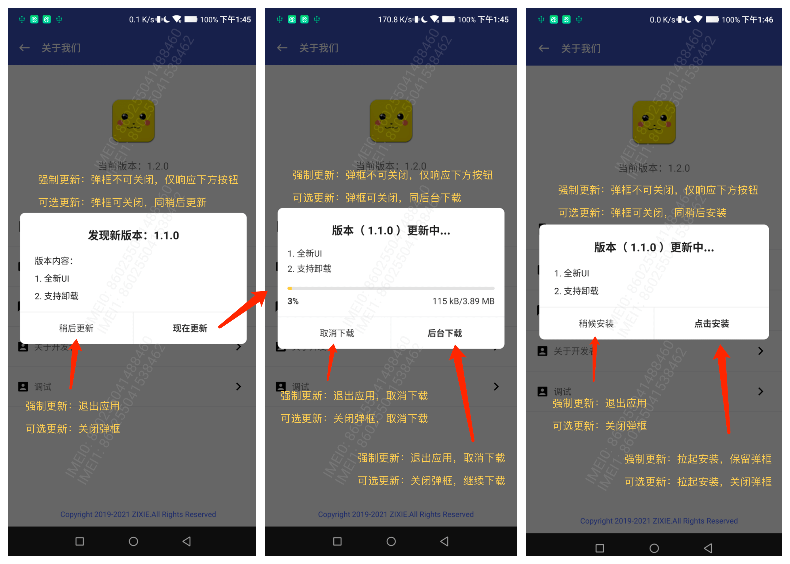

# 应用更新


[  ](https://github.com/bihe0832/AndroidAppFactory/tree/master/Framework)
[  ](https://search.maven.org/artifact/com.bihe0832.android/framework)

## 功能简介

基于公共框架的应用更新模块，主要定义了更新相关的数据结构，以及各种更新类型下的处理方式。以下为五种场景下的具体更新策略:

| 类型     | 强制更新                         | 可选更新                         | 红点更新                         | 无状态更新 | 最新版本       |
| ------------ | -------------------------------- | -------------------------------- | -------------------------------- | ---------- | -------------- |
| 进入首页     | 弹框更新、侧边栏红点             | 弹框更新、侧边栏红点             | 侧边栏红点                       | 无提示     | 无提示         |
| 进入关于页   | 弹框更新 <BR> 版本更新提示发现新版本 | 弹框更新<BR>版本更新提示发现新版本 | 弹框更新<BR>版本更新提示发现新版本 | 无提示     | 无提示         |
| 点击检查更新 | 弹框更新                         | 弹框更新                         | 弹框更新                         | 弹框更新   | 提示已经最新版 |

此外还增加了一些体验优化的细节。具体包括：

- 非强制更新，首次安装不弹框

- 非强制更新，弹框取消不再主动弹框




关于配置更新，目前也增加了专门的配置WebUI，对应地址为：[https://cdn.bihe0832.com/tools/config/update.html](https://cdn.bihe0832.com/tools/config/update.html)


## 组件信息

#### 引用仓库

引用仓库可以参考 [组件使用](./../start.md) 中添加依赖的部分

#### 组件使用

```groovy
implementation 'com.bihe0832.android:framework:+'
```
## 组件功能

### UpdateDataFromCloud

- 更新数据结构及默认值

### UpdateDataFromCloudExt

- 根据更新的数据结构计算当前的更新类型

### UpdateHelper

- 根据更新数据结构结合场景展示更新弹框

### UpdateInfoLiveData

- 更新数据的全局LiveData，其余地方可以观察他处理更新相关的UI
