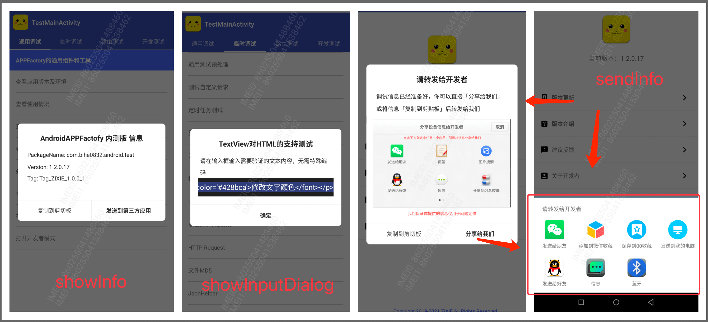

# LibDebug


[  ](https://github.com/bihe0832/AndroidAppFactory/tree/master/LibDebug)
[  ](https://search.maven.org/artifact/com.bihe0832.android/lib-debug)

## 功能简介

应用调试相关的通用工具，例如分享调试信息等

## 组件信息

#### 引用仓库

引用仓库可以参考 [组件使用](./../start.md) 中添加依赖的部分

#### 组件使用

```groovy
implementation 'com.bihe0832.android:lib-debug:+'
```

## 组件功能

### DebugTools

- 支持弹框展示调试信息，弹出输入框、分享调试信息文本，复制信息到剪切板



