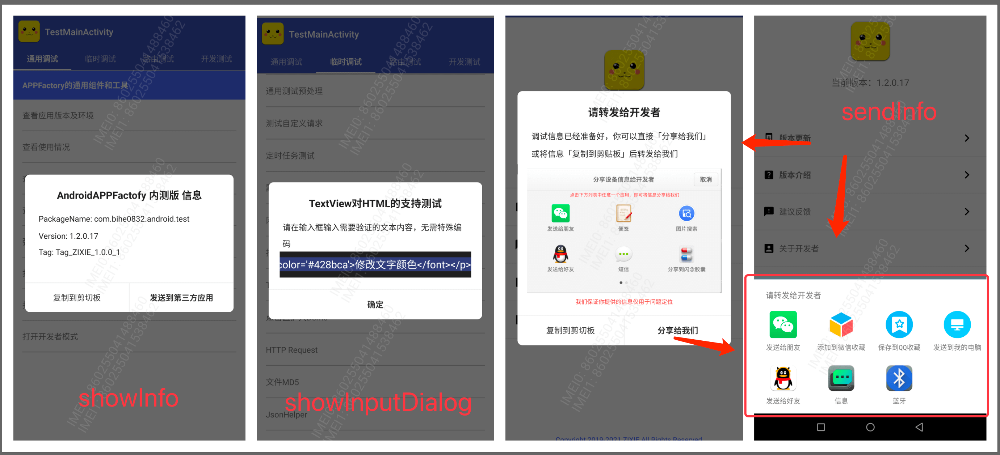

# LibDialog


[  ](https://github.com/bihe0832/AndroidAppFactory/tree/master/LibDialog)
[ ](https://search.maven.org/artifact/com.bihe0832.android/lib-dialog)


## 功能简介

自定义样式的对话框，包括通用的、带进度的、以及全屏非全屏的loading

## 组件信息

#### 引用仓库

引用仓库可以参考 [组件使用](./../start.md) 中添加依赖的部分

#### 组件使用

```groovy
implementation 'com.bihe0832.android:lib-dialog:+'
```

## 组件功能

### CommonDialog

- 通用弹框，所有组件显示可控，调用方式可以参考 `BaseTest` 里面的 `TestDialogFragment`，显示样式参考：

    

### DownloadProgressDialog

- 带进度下载弹框，调用方式可以参考 `BaseTest` 里面的 `TestDialogFragment`，显示事例可以参考：

    

### LoadingDialog

- Loading 对话框，分全屏和非全屏，调用方式可以参考 `BaseTest` 里面的 `TestDialogFragment`
