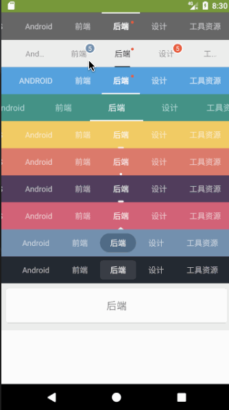

# LibFlycoTabLayout


[  ](https://github.com/bihe0832/AndroidAppFactory/tree/master/LibFlycoTabLayout)
[ ](https://search.maven.org/artifact/com.bihe0832.android/lib-flycotablayout)

## 功能简介

FlycoTabLayout 是一个 Android TabLayout 库，目前有三个 TabLayout。对应github：[https://github.com/H07000223/FlycoTabLayout/blob/master/README_CN.md](https://github.com/H07000223/FlycoTabLayout/blob/master/README_CN.md)

## 组件信息

#### 引用仓库

引用仓库可以参考 [组件使用](./../start.md) 中添加依赖的部分

#### 组件使用

```groovy
implementation 'com.bihe0832.android:lib-flycotablayout:+'
```

## 组件功能

Android TabLayout 库，支持图标，支持红点和数字，目前有三个 TabLayout，使用时可以参考文章：https://blog.csdn.net/poorkick/article/details/70215672，

组件效果如下：



体验相关效果可以直接参考代码：https://github.com/bihe0832/AndroidAppFactory/tree/master/BaseDebug/src/main/java/com/bihe0832/android/base/debug/tab

### CommonTabLayout

- 没有继承HorizontalScrollView不能滑动,对于ViewPager无依赖

### SlidingTabLayout

- 滑动TabLayout,对于ViewPager的依赖性强

### SegmentTabLayout

- 可以看做是一个特殊的CommonTabLayout