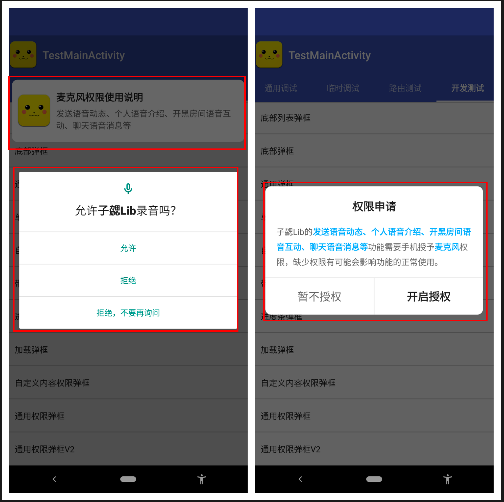

# LibPermission


[  ](https://github.com/bihe0832/AndroidAppFactory/tree/master/LibPermission)
[ ](https://search.maven.org/artifact/com.bihe0832.android/lib-permission)

## 功能简介

Android 权限管理

## 组件信息

#### 引用仓库

引用仓库可以参考 [组件使用](./../start.md) 中添加依赖的部分

#### 组件使用

```groovy
implementation 'com.bihe0832.android:lib-permission:+'
```

## 组件功能



### PermissionDialog

- 检查权限的引导弹框、可配合PermissionsActivity 继承后实现自定义界面

- 支持同时申请单一权限或者多个权限

### PermissionManager

- 添加权限弹框时的权限说明

- 检查权限并弹框引导，结果回调更精细、支持相同权限不同场景的文案配置

- 基于 [IntentUtils](./../noui/lib-utils-apk.md#intentutils) 打开对应权限的设置页面，具体权限对应的设置页面的跳转参数可以参考 [Android 权限 及设置描述信息](https://blog.bihe0832.com/android-permission.html)

### PermissionsActivity & PermissionsActivityV2

- 检查权限并弹框引导的中转页、可继承并定制

### FloatPermissionWrapper

- 悬浮窗权限的检查方法

### UniqueDialogManager

- 支持过滤重复弹框的弹框管理