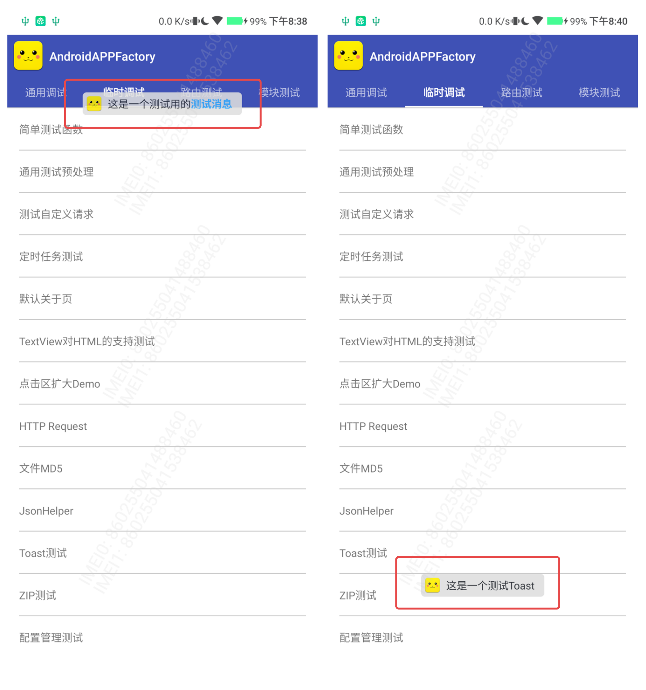

# LibToast


[  ](https://github.com/bihe0832/AndroidAppFactory/tree/master/LibToast)
[ ](https://search.maven.org/artifact/com.bihe0832.android/lib-toast)

## 功能简介

通用的Toast弹框，支持各种自定义设置的Toast

## 组件信息

#### 引用仓库

引用仓库可以参考 [组件使用](./../start.md) 中添加依赖的部分

#### 组件使用

```groovy
implementation 'com.bihe0832.android:lib-toast:+'
```

## 组件功能

### ToastUtils



- 通用的Toast 弹框、解决设备兼容性问题

- 可定制Toast，上、下、左、右方位以及距离页边距的距离

- Toast内容支持基础的HTML内容
