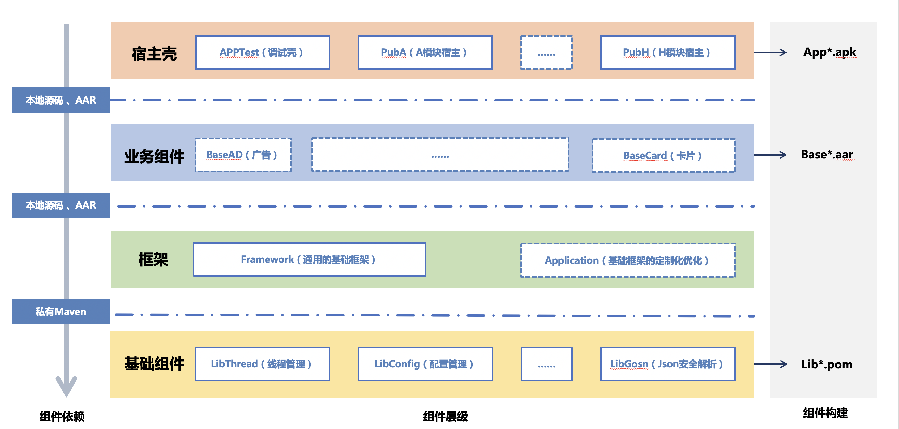

这是AAF的一个总体架构：

整个AAF框架共有四层：

- **基础组件**：基础组件 `Router*` 是路由相关的基础组件，`Lib*` 是自己沉淀或者统一对比以后选择的第三方技术栈，与业务无关，可通用。

- **公共组件**：基础框架 `Framework` 负责通用资源、公共声明、页面路由以及对于底层第三方库的二次封装，所有业务通用的基础通用功能。`Common*` 则是聚焦一个具体的业务无关的功能，例如反馈、内置浏览器等，这部分功能也与业务无关，可通用。

- **业务组件**：基础框架 `Application` 包含与业务相关的一些公共资源定义，基础功能封装等。`Base*` 则是聚焦一个具体的业务功能，例如页面卡片、广告等。

- **应用组件**：应用组件是可以独立运行的最小单元，而且他们基本只是一个Android Application 的空壳加一些配置文件，所有的业务逻辑都在业务组件层实现。其中里面比较特别的是APPTest，他既是底层业务组件开发中的临时入口，同时也是一些基础功能 和 所有 Pub的测试入口。

对于整个框架的更多内容，可以参考 [AAF相关文档](./../summary/links.md) 中关于AAF框架相关的文章，**在本系列文档中，主要介绍基础组件和公共组件相关的功能。**
